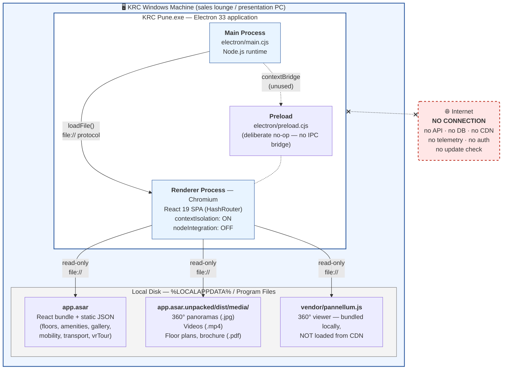
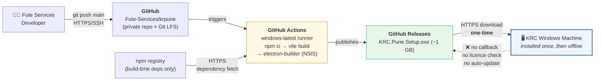

# 1. Network Architecture Diagram — KRC Pune

**Product:** KRC Pune — VR / Amenities Sales Experience Application
**Vendor:** Fute Services
**Document date:** 16 July 2026
**Assessed at commit:** `5876920` (`main`)

---

## 1. Summary

KRC Pune is a **standalone Windows desktop application with no runtime network
dependency**. Once installed, it does not connect to any server, API, database or
third-party service. It can run on a machine that is permanently air-gapped.

There is therefore **no application network topology to diagram** in the
conventional sense (no tiers, no load balancers, no DMZ, no data centre). The
only network activity in the product's entire lifecycle occurs **before**
delivery — during build and distribution — which is diagrammed separately in §3.

---

## 2. Runtime architecture (on the KRC end-user machine)

This is the complete picture of the application as it runs at KRC.

### 2.1 Runtime network ports

| Direction | Port | Protocol | Purpose |
|---|---|---|---|
| Inbound | **None** | — | The app opens no listening socket |
| Outbound | **None** | — | The app initiates no connection |

The application requires **no firewall rule, no proxy exception, and no
whitelisting** to function.

### 2.2 The one deliberate exception — outbound handoff

The Electron main process contains two guards that **hand any external URL to the
user's default system browser and refuse to load it inside the app window**:

- `setWindowOpenHandler` → `shell.openExternal(url)`, returns `{ action: 'deny' }`
- `will-navigate` → any non-`file://` URL is `preventDefault()`ed and handed off

Any resulting traffic belongs to the **system browser, not to KRC Pune**, and
happens only on an explicit user click. In the current build the only such link
(a Microsoft Teams button) is **commented out and not rendered**, so no external
link is reachable in the shipped UI.

---

## 3. Build & distribution architecture (vendor side — not on KRC's network)

Network activity exists only in the **pipeline that produces the installer**.
This runs on Fute Services / GitHub infrastructure and terminates the moment the
`.exe` is handed to KRC.

### 3.1 Build-time third parties

| Service | Role | Data exposed | Reaches KRC runtime? |
|---|---|---|---|
| GitHub (repo, Actions, Releases) | Source control, CI, installer hosting | Source code, build artifacts | ❌ No |
| npm registry | Build-time dependency resolution | None (public packages) | ❌ No — dependencies are compiled into the bundle |

No KRC data of any kind passes through this pipeline. The pipeline carries
**product content only** (renders, plans, marketing media).

---

## 4. Points KRC IT should note

These are disclosed proactively for completeness; each is a **distribution**
concern, not a runtime network concern.

| # | Observation | Impact | Recommendation |
|---|---|---|---|
| 1 | **Installer is not code-signed.** Windows SmartScreen shows an "unknown publisher" warning; users are told to click *More info → Run anyway* | Trains users to bypass a security control; installer integrity/authenticity is not cryptographically verifiable | Purchase an OV/EV code-signing certificate. **The CI pipeline already supports this** — it reads `WINDOWS_CERT_BASE64` / `WINDOWS_CERT_PASSWORD` repo secrets and signs automatically once they are set. No code change required |
| 2 | **Installer is distributed via a public GitHub Release URL** with a stable `latest` link | Anyone with the link can download the build and its bundled marketing media | If KRC requires it, switch to a private/authenticated channel or hand-deliver the installer |
| 3 | **No auto-update mechanism** | A security fix requires manual redistribution and reinstall | Acceptable for an offline kiosk app; agree a patch-delivery process with KRC |

---

## 5. Attestation

> The runtime architecture above was verified by scanning the **compiled
> production bundle** (`code/dist/assets/`) for outbound hosts. No external
> service endpoint is present. This is a **Fute Services self-declaration** based
> on source and build inspection at commit `5876920` — it is not an independent
> third-party audit.

_Prepared by:_ _[Name, Title]_ · Fute Services · 16 July 2026
