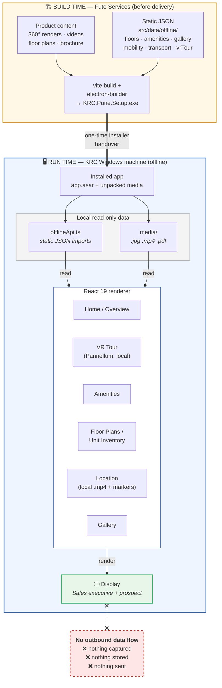

# 2. Data / Information Flow Diagram — KRC Pune

**Product:** KRC Pune — VR / Amenities Sales Experience Application
**Vendor:** Fute Services
**Document date:** 16 July 2026
**Assessed at commit:** `5876920` (`main`)

---

## 1. Summary

KRC Pune is a **read-only content presentation application**. Data flows in
exactly one direction:

> **bundled static asset on local disk → screen**

The application:

- **collects no data** — it has no forms, no text inputs, no submit handlers
- **stores no data** — no `localStorage`, `sessionStorage`, `indexedDB`, or cookies
- **transmits no data** — no API calls, no telemetry, no analytics, no crash reporting
- **processes no personal data** — no PII, no user accounts, no authentication

**There is no personal data in this system.** Consequently there is no data
classification, retention schedule, cross-border transfer, encryption-in-transit
requirement, or data-subject-rights exposure to assess.

---

## 2. Data flow diagram

---

## 3. Data inventory

| Data set | Classification | Contains PII? | At rest | In transit | Retention |
|---|---|---|---|---|---|
| Floor / unit inventory (`floors.json`) | Business — Internal | ❌ No | Local disk, inside `app.asar` | ❌ Never transmitted | Life of installation |
| Amenities, gallery, mobility, transport (JSON) | Business — Public marketing | ❌ No | Local disk, inside `app.asar` | ❌ Never transmitted | Life of installation |
| 360° panoramas, videos, brochure PDF | Business — Public marketing | ❌ No | Local disk, `app.asar.unpacked/dist/media/` | ❌ Never transmitted | Life of installation |
| User / prospect data | — | **N/A — none captured** | — | — | — |
| Credentials / tokens | — | **N/A — none at runtime** | — | — | — |
| Logs / telemetry | — | **N/A — none generated** | — | — | — |

### 3.1 Trust boundaries

There is **one** trust boundary — the installer handover. After it is crossed,
the application is self-contained and inert with respect to data movement.

| Boundary | Crossed by | Direction | Control |
|---|---|---|---|
| Fute Services build → KRC machine | `KRC.Pune.Setup.exe` | Vendor → KRC, **one-time** | Manual/HTTPS download. **Currently unsigned** — see `01-network-architecture.md` §4 |
| KRC machine → Internet | *nothing* | — | No outbound path exists |

---

## 4. Data-at-rest note for KRC IT

Because the app is offline and read-only, the realistic data concern is **not
leakage in transit — it is physical/local access to the installed content**:

- The bundled content (floor plans, unit inventory, unreleased renders) sits
  unencrypted on the local disk inside `app.asar`. **`.asar` is an archive
  format, not encryption** — its contents can be extracted by anyone with file
  access to the machine.
- The same content is downloadable by anyone holding the public GitHub Release
  link.

**Recommendation:** if any bundled content is commercially sensitive
(e.g. unreleased inventory or pricing), protect it with **machine-level
controls** — disk encryption (BitLocker), restricted local accounts, and kiosk
lockdown on the sales-lounge PC — plus a private distribution channel. Attempting
to protect it inside the application itself would provide no real assurance.

---

## 5. Attestation

> Verified by direct code inspection at commit `5876920`: no storage APIs, no
> input/form elements, no analytics or telemetry SDKs, and no outbound hosts in
> the compiled bundle. This is a **Fute Services self-declaration**, not an
> independent third-party audit.

_Prepared by:_ _[Name, Title]_ · Fute Services · 16 July 2026
