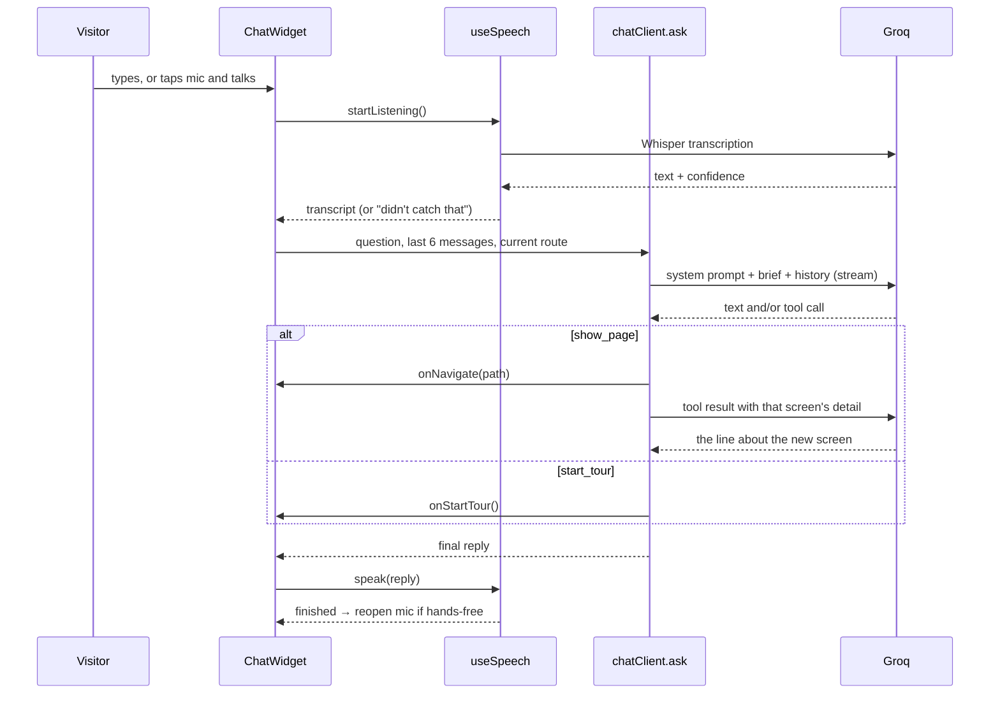

# The Project Guide (chatbot)

The guide is the voice assistant in the bottom-right corner of every signed-in
screen. A visitor can type or talk to it, it answers out loud about Commerzone
Baner, moves the app to the screen it is describing, and can run a narrated
tour of the whole project.

It has no backend. Everything below runs in the browser and talks directly to
Groq (conversation and microphone) and ElevenLabs (voice).

---

## At a glance

| What | Where | Uses |
|---|---|---|
| Conversation | `src/chatbot/chatClient.ts` | Groq `openai/gpt-oss-120b`, streamed, with tools |
| What it knows | `src/chatbot/knowledge.ts` | Hand-written brief + the live floor table from `src/data/FloorData.ts` |
| Voice out / mic in | `src/chatbot/useSpeech.ts` | ElevenLabs → Groq Orpheus → browser voice; Groq Whisper for the mic |
| Guided tour | `src/chatbot/tour.ts` | Fixed narration, 18 stops |
| Pre-rendered tour audio | `scripts/generate-tour-audio.mjs` → `public/media/tour/`, indexed in `src/chatbot/tourAudio.json` | Rendered once, played free |
| Panel and launcher | `src/components/chat/ChatWidget.tsx` | Mounted in `src/app/RootLayout.tsx` |
| Orb and waveform | `src/components/chat/VoiceVisuals.tsx` | Keyframes in `src/index.css` (`krc-guide-*`) |
| Prepared answers | `src/chatbot/faq.ts` + `faqAnswers.json`, clips indexed in `faqAudio.json` | No model, no tokens |
| Language detection | `src/chatbot/language.ts` | Shared by the model's instructions and the prepared answers |
| Speaking while writing | `src/chatbot/speechChunks.ts` | Cuts the streamed reply into sentences |
| Talking over the guide | `src/chatbot/bargeIn.ts` | Pure detector; wired up in `useSpeech.ts` |
| Tests | `tests/chatbot.spec.ts`, `tests/guide-tour.spec.ts`, `tests/guide-voice.spec.ts`, `tests/screenshots.spec.ts` | Playwright |

---

## Setup

Copy `.env.example` to `.env` (locally) or set the same names in Vercel →
Project → Settings → Environment Variables.

| Variable | Required | Purpose |
|---|---|---|
| `VITE_GROQ_API_KEY` | **Yes** | Conversation, microphone, and the second voice. Without it the launcher does not render at all. |
| `VITE_ELEVENLABS_API_KEY` | No | Best voice, and the only one that reads Devanagari. |
| `VITE_ELEVENLABS_VOICE_ID` | No | Defaults to Sarah (`EXAVITQu4vr4xnSDxMaL`). |
| `VITE_GROQ_TTS_VOICE` | No | Groq fallback voice. Defaults to `Autumn`. Model terms must be accepted once at console.groq.com. |

> **The keys ship inside the JavaScript bundle.** Anyone with devtools on the
> deployed site can read them. Use keys made for this kiosk only, keep a spend
> limit on each, and treat rotating a key as a redeploy.

---

## How one question is answered



### 1. The system prompt

Built fresh for every turn in `ask()`:

1. **House rules** (`HOUSE_RULES` in `chatClient.ts`): who the guide is, how to
   speak, how to shape an answer, how to hold a conversation, and what it must
   refuse.
2. **The brief** from `knowledgeBase(pathname, topic)`.
3. One line naming the screen the visitor is on.

### 2. How an answer is shaped

Every reply follows the same pattern, because it is read aloud:

1. **Direct answer first.** No "Sure", "Great question", or repeating the question.
2. **One or two facts** from the brief that back it up, numbers quoted exactly.
3. **Optionally, one short offer** of what to do next, as a question. Not on every reply.

Also: two to four sentences, under about 60 words, no markdown or lists, and
units written as spoken ("square feet", not "sq ft").

**Language is decided in code, not left to the model.** `replyLanguage()` in
`chatClient.ts` looks at the question: any Devanagari means Hindi in
Devanagari; two or more common Hindi words in Latin letters ("kitna", "hai",
"dikhao"…) mean Hinglish; otherwise English. Short replies like "ok" or "haan"
inherit the language of the visitor's last real question. The system prompt
then ends with an explicit instruction to write *every* sentence in that
language, and the same instruction is appended to the visitor's own turn on the
wire (the panel and stored history keep what they actually said). Said only at
the top, it held for the facts and slipped on the closing offer. The prompt rule alone was not enough: with an English brief, a
Devanagari question came back in English, and Hinglish answers drifted into
"Want to see the floor plan?".

### 3. Holding a conversation

The rules tell the model that:

- **"haan", "yes", "ok", "dikhao"** accept the offer it just made, so it acts (for a screen, it calls `show_page`).
- **"aur batao", "uska size?", "wahan kya hai"** continue the last topic or the current screen, without repeating.
- **A garbled or cut-off question** ("the uh podium what the") gets only one short clarifying question, under 15 words, with no facts in it and no mention of the microphone. A looser wording of this rule let the model describe the podium in 40 words and tack a question on the end.
- **Never more than three things in one reply.** With more (the four amenity levels, seven drive times), it names two or three and offers the screen with the rest.
- **Greetings** only if the visitor greets; it never re-introduces itself.
- **Thanks, small talk, goodbye** get one warm line; off-topic questions get a one-line redirect.

History is the **last 6 messages** (`MAX_HISTORY` in `ChatWidget.tsx`). Error
messages shown to the visitor are marked `failed` and are never sent back to
the model.

### 4. What the model is shown (the brief)

The Groq account allows **8,000 tokens per minute**, and a question that
navigates costs two requests. Sending everything every turn (~3,000 tokens)
rate-limited a single visitor, so the brief is assembled per turn:

| Always | Only when relevant |
|---|---|
| Every screen's title, route and one-line summary | Full detail for the screen the visitor is on |
| | Full detail for up to **2 screens that match the topic** (`TOPICS` keywords in `knowledge.ts`, in English, Hinglish and Devanagari, matched against this question and the previous one) |
| | The 22-row floor carpet table, on Inventory/floor-plan screens or when the question mentions floors, carpet area, sq ft, a tower, or an ordinal like "10th" (also फ्लोर / मंज़िल / कार्पेट / टावर) |

That topic matching is what lets "airport kitna door hai" be answered from the
Home screen, even though the distance lives on Project Info.

### 5. Tools

| Tool | What happens |
|---|---|
| `show_page { path }` | Only routes that exist in `PAGES` (or `/unitplan/...`) are followed. The app navigates, and the tool result returns that screen's detail so the next line describes it accurately. An unknown path is refused back to the model. |
| `start_tour {}` | The turn ends and the tour takes over the panel. |

At most **two rounds** per question (answer → tool → answer). If the first
round already carries a real answer (12+ words) alongside the tool call, the app
navigates and the turn ends there: a second round only restated it, drifted
out of the visitor's language doing so, and cost another ~2,000 tokens. When a
second round does run, text from the two rounds is joined with a space, and the
tool result repeats the language instruction because it is the last thing the
model reads. If a turn ends with no usable text, the guide still says something
("Here is the Gallery screen.").

### 6. Safety nets

- `reasoning_format: 'hidden'` keeps gpt-oss's thinking out of the reply.
  `scrubMeta()` is a second guard that strips lines like "We need to respond…".
- **Rate limits (429)** are waited out silently for up to 20 seconds
  (`RATE_LIMIT_WAIT_MS`) using Groq's `retry-after`, instead of apologising.
  Each request is about 2,000 tokens and a navigating question makes two, so
  two of those back to back empty the 8,000-token bucket; Groq then asks for
  11–14 s.
- **Empty turns are retried once.** gpt-oss occasionally finishes a request
  with no text and no tool call. `ask()` repeats that request once before
  falling back to "Sorry, I missed that" (console: `[guide] empty turn from the
  model, asking again`).
- `explainError()` turns failures into plain sentences (bad key, offline, busy),
  and in hands-free mode the error is spoken too.

---

## Voice

### Speaking

`speak(text)` tries, in order:

1. **ElevenLabs** `eleven_flash_v2_5`: best quality, handles Hindi. Disabled for the rest of the session after a 401/429 (usually an empty quota).
2. **Groq Orpheus** `canopylabs/orpheus-v1-english`: 200 characters per request, so long replies are spoken in pieces. English only, so Devanagari skips it. Disabled for the session after a 400/401.
3. **The browser's own voice** (`speechSynthesis`), as a last resort so the guide never goes mute.

**Speed:** all audio plays at `SPEECH_RATE = 0.9` (`useSpeech.ts`), which covers
ElevenLabs, Groq and the tour clips at once without re-rendering. The browser
voice uses `utterance.rate = 0.92`. Change `SPEECH_RATE` to adjust: lower is slower.

### Listening

- Recorded with `MediaRecorder` and transcribed by Groq `whisper-large-v3-turbo`.
  Not the Web Speech API, which does not exist on iPad.
- Recording stops by itself after **1.4 s of quiet** once speech has started
  (`SILENCE_MS`). The speech threshold is deliberately low (`SPEECH_LEVEL = 0.012`)
  and judged against the room's own noise floor.
- A transcript is thrown away if it is a known Whisper hallucination ("thank
  you", "you", "."), shorter than 3 characters, or below `MIN_CONFIDENCE = -0.9`.
  The panel then shows "I didn't catch that".
- The Whisper prompt is one plain sentence, not a list of terms. A term list
  was being recited back as a fake question when the room was silent.

### Hands-free

When the visitor starts with the mic, the mic reopens automatically after each
spoken answer. It stops when they type, press Stop, close the panel, start the
tour, or when nothing is heard.

---

## Faster, and ready for the next visitor

### Prepared answers

The questions every visitor asks — airport, railway station, campus size,
parking, LEED, towers, food court, developer, where the project is — are
answered from `faqAnswers.json` without calling the model: instant, no tokens,
and a pre-rendered clip when one exists. Each exists in English, Hinglish and
Devanagari, and the language is chosen the same way as for model replies.

Matching is deliberately strict (`faq.ts`). A question is only answered from
here when exactly one rule matches, it is ten words or fewer, and it is not two
questions joined with "and"/"aur". "10th floor ka carpet area", "metro station
kitna door", "parking booking" and "where is the food court's terrace" all go to
the model. A slow answer is a nuisance; a confidently wrong one is worse.

To change an answer: edit `faqAnswers.json` (every fact must match
`knowledge.ts`), then `npm run faq:audio -- --force`. Clips go to
`public/media/faq/`; lines without a clip are spoken live.

### Spoken as it is written

A model reply is no longer voiced only after it has finished. `ChatWidget`
feeds the streamed text through `nextSpeakable()` (`speechChunks.ts`), which
releases each complete sentence — joining very short ones to the next, and
never splitting "2.7 million" or "approx. 17" — to `speech.beginSpeech()`. Each
sentence starts rendering at once and plays when the previous one ends, so the
first sentence is heard while the model is still writing. Renders run one at a
time, because ElevenLabs answers parallel bursts with 429 and a 429 disables it
for the session.

### Interrupting the guide

- **Tap the mic** while it is speaking: it stops and listens. Works everywhere.
  (This also fixed a race where that tap opened two recorders.)
- **Just talk over it**, in a hands-free conversation, on non-iOS devices. While
  the guide speaks, the mic is monitored and `bargeIn.ts` compares its level to
  the guide's own playback level: the visitor only counts when clearly louder
  than the echo the playback explains, for at least 300 ms. It errs towards
  carrying on — a nearby conversation or a cough does not interrupt it. Not used
  on iOS/iPadOS, where an open mic switches the audio session to voice-chat mode
  and quietens playback, nor while the browser's own voice is speaking, which
  cannot be measured.
- A question that arrives while the previous answer is still being written now
  replaces it; it used to be silently dropped.

Real speaker-to-microphone echo cannot be reproduced in a headless test. The
detector is tested on loudness traces (echo only, a visitor starting to talk, a
constant nearby talker, a cough); **check barge-in on the actual kiosk hardware
before relying on it.**

### Clearing the conversation for the next visitor

The kiosk is shared, so the conversation is wiped automatically: **one minute**
after the last guide activity with the panel closed, or **two minutes** with it
open and nothing touched anywhere in the app. It never resets while the guide is
speaking, listening, thinking or touring. The reset also turns the voice back on.

## The guided tour

- 18 stops in a sales order (overview → numbers → location → building → VR →
  amenities → inventory and plans → sustainability → gallery → profile → film),
  defined in `TOUR` in `src/chatbot/tour.ts`.
- Each stop navigates, adds the line to the panel, speaks it, then waits
  `DWELL_AFTER_SPEECH_MS = 4500` ms. A stop is never shorter than the line takes
  to say at 150 words per minute, so a muted or silent device doesn't flick
  through the screens.
- Lines play from **pre-rendered clips** when they exist, and fall back to live
  voice otherwise.
- A typed or spoken question during the tour ends the tour.

### Changing a tour line

1. Edit the line in `tour.ts`. Every fact must also be in `knowledge.ts`.
2. Re-render the audio: `npm run tour:audio -- --force` (needs
   `VITE_ELEVENLABS_API_KEY` or `VITE_GROQ_API_KEY` in `web/.env`). Without
   `--force` it only renders missing clips.
3. Commit `public/media/tour/*` and `src/chatbot/tourAudio.json`.

---

## Changing what the guide knows

The guide may only say what is in `knowledge.ts`. It is told explicitly that
anything missing there, such as pricing, rent, availability, possession or
tenants, is a question for the sales team.

- **A screen's text changed:** update its `summary` / `detail` in `PAGES`, and the matching tour line.
- **A new screen:** add a `PAGES` entry with the exact router path, and keywords in `TOPICS` if it has `detail`.
- **Floor areas:** do not copy them. They are read live from `FloorData.ts`.
- **Visitors use a word the matcher misses:** add it (lower-case English, Hinglish, or Devanagari) to that screen's `TOPICS` list. Devanagari matters: Whisper writes Hindi speech in Devanagari, and a question that matches no keyword gets no detail, so the guide says it does not know.

---

## The launcher and panel

- **Launcher:** glass pill with the voice orb, "Ask the guide / Tap to talk, or
  type", and a mic chip. A band of light passes every 7 s (turned off under
  `prefers-reduced-motion`). The accessible name **"Ask the guide"** is used by
  the tests, so keep it.
- **Orb:** a glass bead with a rotating arc. When idle it animates in CSS only,
  so it costs nothing behind the VR scene. While listening or speaking it
  follows the real audio level.
- **Status line:** Listening… / One moment… / Thinking… / Speaking… / Tour — screen name.
- **Placement:** bottom-right on purpose. The left side and the sidebar rail
  hold controls a floating button would cover.

---

## Testing

The Playwright suite runs against the **built** app (`vite preview` serves
`dist/`), so **rebuild before testing a change**:

```bash
npx vite build
npx playwright test tests/chatbot.spec.ts tests/guide-tour.spec.ts tests/guide-voice.spec.ts
npx playwright test tests/screenshots.spec.ts -g "project guide"   # → test-results/screens/guide-*.png
```

- In a build with no `VITE_GROQ_API_KEY`, the guide tests check the launcher is absent and then skip.
- `guide-voice.spec.ts` feeds real silence and a recorded question
  (`tests/fixtures/spoken-question.wav`) through Chrome's fake microphone.
- A real key spends money on every run. For CI, use a dummy key: the tests
  accept a readable error as a pass.

---

## Troubleshooting

| Symptom | Likely cause | Fix |
|---|---|---|
| No launcher at all | `VITE_GROQ_API_KEY` missing at build time | Set it and rebuild/redeploy |
| "API key was rejected" | Wrong or revoked Groq key | Replace the key, redeploy |
| Voice suddenly robotic | ElevenLabs quota empty, then Groq failing, so the browser voice is in use | Top up ElevenLabs or accept Groq terms; reload the page (a disabled voice stays off until reload) |
| Replies are slow to start | Rate limit being waited out (see console `[guide] rate limited`) | Normal under load; a higher Groq tier removes it |
| "I don't have that" for something on a screen | Missing from `knowledge.ts`, or the topic keyword isn't in `TOPICS` | Add the fact or the keyword |
| Guide answers a question nobody asked | Whisper hallucinating on noise | Check the console `[guide] heard "..." (confidence ...)`; add the phrase to `HALLUCINATIONS` |
| Mic never hears anyone | Kiosk mic quieter than expected | Lower `SPEECH_LEVEL` a little in `useSpeech.ts` |
| Voice too fast or slow | | Adjust `SPEECH_RATE` (`useSpeech.ts`) |
| Robotic voice, console shows `ElevenLabs 401` | ElevenLabs credits used up (`quota_exceeded`) — the free tier is 10,000 a month | Top up or wait for the monthly reset, then reload |
| Robotic voice, console shows `Groq TTS 400` | Orpheus model terms not accepted | Org admin accepts them once at console.groq.com (playground, `canopylabs/orpheus-v1-english`) |
| `npm run faq:audio` renders nothing | Same two causes as above | Fix the voice account, run it again — it only renders what is missing |
| Guide interrupts itself | Speaker echo louder than the detector expects | Lower the kiosk volume or move the mic; raise `ECHO_MARGIN` in `bargeIn.ts` |
| Talking over the guide does nothing | iOS, the browser voice, not in a hands-free conversation, or speaking quietly | Tap the mic instead; `MIN_LEVEL` in `bargeIn.ts` sets how loud is needed |
| A change doesn't show up in tests | Tests serve the old `dist/` | `npx vite build` first |
